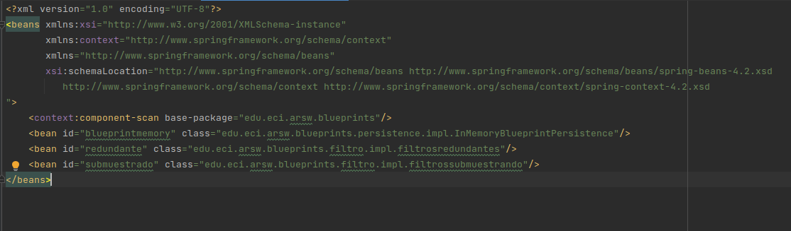

### Escuela Colombiana de Ingeniería

### Arquitecturas de Software
## Laboratorio Componentes y conectores  Middleware- gestión de planos
### Dependencias
* [Ejercicio introductorio al manejo de Spring y la configuración basada en anotaciones](https://github.com/ARSW-ECI-beta/DIP_DI-SPRING_JAVA-GRAMMAR_CHECKER).

### Descripción
En este ejercicio se va a construír un modelo de clases para la capa lógica de una aplicación que permita gestionar planos arquitectónicos de una prestigiosa compañia de diseño. 

### Parte I.

1. Configure la aplicación para que funcione bajo un esquema de inyección de dependencias, tal como se muestra en el diagrama anterior.

	Lo anterior requiere:

	* Agregar las dependencias de Spring.
	* Agregar la configuración de Spring.
	* Configurar la aplicación -mediante anotaciones- para que el esquema de persistencia sea inyectado al momento de ser creado el bean 'BlueprintServices'.

SOLUCION PUNTO 1

Se genera archivo applicationContext donde se encontraran las configuraciones de spring y configuraciones para que el esquema de persistencia sea inyectado al momento de ser creado el bean 'BlueprintServices' 

2. Complete los operaciones getBluePrint() y getBlueprintsByAuthor(). Implemente todo lo requerido de las capas inferiores (por ahora, el esquema de persistencia disponible 'InMemoryBlueprintPersistence') agregando las pruebas correspondientes en 'InMemoryPersistenceTest'.

SOLUCION PUNTO 2

Se realiza ajustes en el esquema de persistencia y servicios, adicional se realiza implementacion de metodos para obtener blueprints y blueprints por autor.

TEST PUNTO 2

3. Haga un programa en el que cree (mediante Spring) una instancia de BlueprintServices, y rectifique la funcionalidad del mismo: registrar planos, consultar planos, registrar planos específicos, etc.

SOLUCION PUNTO 3

Se genera aplicacion mediante spring donde se tiene una clase Main con una instancia de blueprintservices y validaciones de funcionalidad "registrar planos, consultar planos, registrar planos específicos"
la ruta de la aplicacion es /blueprints/ui/main

4. Se quiere que las operaciones de consulta de planos realicen un proceso de filtrado, antes de retornar los planos consultados. Dichos filtros lo que buscan es reducir el tamaño de los planos, removiendo datos redundantes o simplemente submuestrando, antes de retornarlos. Ajuste la aplicación (agregando las abstracciones e implementaciones que considere) para que a la clase BlueprintServices se le inyecte uno de dos posibles 'filtros' (o eventuales futuros filtros). No se contempla el uso de más de uno a la vez:
    * (A) Filtrado de redundancias: suprime del plano los puntos consecutivos que sean repetidos.
    * (B) Filtrado de submuestreo: suprime 1 de cada 2 puntos del plano, de manera intercalada.

SOLUCION PUNTO 4

Se realiza implementacion de filtros para redundancias y submuestreo. Se crea nuevo archivo filtros donde tiene la interface y la respectiva implementacion para cada uno de los tipos de filtros

5. Agrege las pruebas correspondientes a cada uno de estos filtros, y pruebe su funcionamiento en el programa de prueba, comprobando que sólo cambiando la posición de las anotaciones -sin cambiar nada más-, el programa retorne los planos filtrados de la manera (A) o de la manera (B). 

SOLUCION PUNTO 5

Se realiza implementacion de pruebas  pruebas punto 4 de los filtros implementados tanto en programa de prueba como test java

